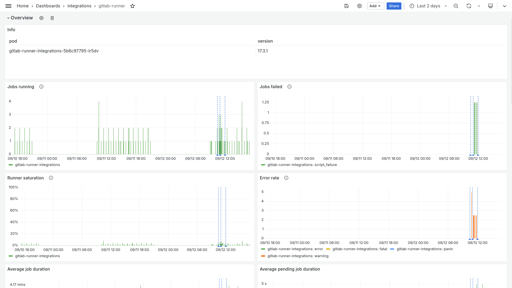

# Set up monitoring

With the dynamic nature of auto scaling, it is recommended to monitor your GitLab CI infrastructure to know when something goes wrong or if anything could be improved. This document describe the basics to monitor your GitLab CI infrastructure when using the Hetzner Fleeting plugin.

## Collect the gitlab-runner metrics

To collect gitlab-runner metrics, you must first [enable the gitlab-runner metrics endpoint](https://docs.gitlab.com/runner/monitoring/#configuration-of-the-metrics-http-server).

Once the metrics endpoint is enabled, you must scrape that endpoint with you monitoring stack. Below is an example using a Prometheus scrape configuration:

```yml
scrape_configs:
  - job_name: gitlab-runner
    static_configs:
      - targets:
          - my-gitlab-runner-host:9252
```

## Trigger alerts

When a problem occurs, you want to be informed to possibly prevent a large amount of failed pipelines.

The following Prometheus alert rule is used to trigger an alert when metrics could not be scraped:

```yml
groups:
  - name: GitLab Runner
    rules:
      - alert: NoMetrics
        annotations:
          summary: No metrics were scraped for more than 1m.
        expr: >
          absent(up{job="gitlab-runner"})
          or
          up{job="gitlab-runner"} == 0
        for: 1m
```

The following Prometheus alert rule is used to trigger an alert when a warnings occur in the gitlab-runner. Please note that most problems in the gitlab-runner are considered as warnings:

```yml
groups:
  - name: GitLab Runner
    rules:
      - alert: GitLabRunnerWarnings
        annotations:
          summary: GitLab Runner warning rate is more than 0 for the past 5m.
        # We remove the increase of failed jobs from the increase of warnings to not
        # be alerted on failed jobs. Note that 1 failed job should produces 2 warnings.
        expr: >
          (
            increase(gitlab_runner_errors_total{job="gitlab-runner", level="warning"}[5m])
            - on (job, instance)
            increase(gitlab_runner_failed_jobs_total{job="gitlab-runner", failure_reason="script_failure"}[5m]) * 2
          ) > 0
        for: 5s
```

The following Prometheus alert rule is used to trigger an alert when an error occur in the gitlab-runner:

```yml
groups:
  - name: GitLab Runner
    rules:
      - alert: GitLabRunnerErrors
        annotations:
          summary: GitLab Runner error rate is more than 0 for the past 5m.
        expr: >
          increase(
            gitlab_runner_errors_total{job="gitlab-runner", level="error|fatal|panic"}[5m]
          ) > 0
        for: 5s
```

## Dashboard

A dashboard presents information on how the gitlab-runner is behaving, for example if you need to reduce costs, to provide enough capacity or research which server type works best for you.

Below is a dashboard example:




A Grafana dashboard definition is [available in the Fleeting plugin repository](../../tools/dashboard.json).
